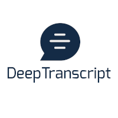

[DeepTranscript](https://www.deeptranscript.com) provides state-of-the-art speech-to-text accuracy in both english and french languages.
In this repository you will see how simple it is to integrate to [DeepTranscript High Availability API](https://app.deeptranscript.com/documentation).

## Batch mode
You have [wav](https://en.wikipedia.org/wiki/WAV), [mp3](https://en.wikipedia.org/wiki/MP3) or [flac](https://en.wikipedia.org/wiki/FLAC) audio recordings and you want an accurate transcription of what has being said ? [batch mode](https://app.deeptranscript.com/documentation#operation/transcriptions_create) is all you need !

**CURL example**
```shell
$ curl https://app.deeptranscript.com/api/transcriptions/ \
  --request POST \
  --header "Authorization: Bearer [API_TOKEN]" \
  --header "Content-Type: application/json" \
  --data '{"recording":"[PUBLIC_URL_TO_AUDIO_RECORDING]","recordingFormat":"mp3","callbackUrl":"[URL_TO_CALL_ONCE_TRANSCRIPTION_READY]","language":"en"}'
```

See [./examples/batch-mode](./examples/batch-mode) and [API documentation](https://app.deeptranscript.com/documentation#operation/transcriptions_create) for more information


## Streaming Mode
**Deeptranscript API** provides two streaming options: **HTTP streaming** and **WebSocket streaming**

With **[HTTP streaming](https://app.deeptranscript.com/documentation#operation/transcriptions_http_stream)**, you can pipe up to 60s of raw audio data to a standard HTTP request. Once input stream ends you get transcription results in no time.


**cURL example**
```shell
$ getAudioStreamSomehow | curl \
  -H "Authorization: Bearer [API_TOKEN]" \
  -X POST \
  --data-binary @- \
  https://stream.deeptranscript.com/\?language\=fr\&sampleRate\=8000\&format\=s16le\&localizeWords\=1
```

see [./examples/streaming/http](./examples/streaming/http) and [API documentation](https://app.deeptranscript.com/documentation#operation/transcriptions_http_stream) for more information

With **[WebSocket streaming](https://app.deeptranscript.com/documentation#operation/transcriptions_ws_stream)**, you can process input streams of any size and get intermediate results indicating if user is speaking and what is being said in almost realtime.

see [./examples/streaming/websocket](./examples/streaming/websocket) and [API documentation](https://app.deeptranscript.com/documentation#operation/transcriptions_ws_stream) for more information


## Before you begin

 - Make sure you [signed up](https://app.deeptranscript.com/signup) and get your 20h evaluation welcome bonus
 - Retrieve your API Token from [members configuration](https://app.deeptranscript.com/account/members)
 - Check requirements and dependencies


### Code examples requirements

 - python 3.6+
 - nodejs v10+


### Setup (debian or ubuntu)
```shell
$ sudo apt install ffmpeg curl git python3-venv unzip flac
$ git clone git@github.com:DeepTranscript/deeptranscript-demo.git deeptranscript-demo
$ cd deeptranscript-demo

# setup python virtualenv
$ python3 -m venv ./venv
$ source ./venv/bin/activate
$ (venv) python --version  # make sure it is 3.6+
$ (venv) pip install -U pip
$ (venv) pip install flask yt-dlp requests

# setup node dependencies
$ (venv) npm install

# setup ngrok (batch-mode only)
$ curl https://bin.equinox.io/c/4VmDzA7iaHb/ngrok-stable-linux-amd64.zip --output ./ngrok.zip \
  && unzip ./ngrok.zip \
  && rm ./ngrok.zip \
  && chmod +x ngrok
```

## Troubleshooting

If anything goes wrong you will find all the information you need on [DeepTranscript Console](https://app.deeptranscript.com)
