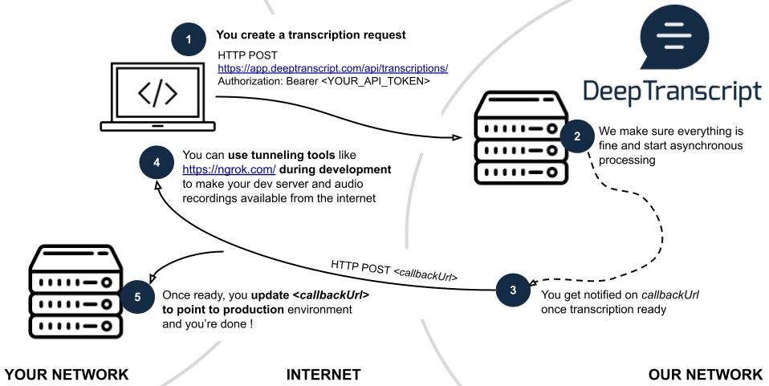

[DeepTranscript BATCH API](https://app.deeptranscript.com/documentation#operation/transcriptions_create) let you transcribe audio recordings in seconds and is very cost effective 

**Here is how it works:**



In this example we will use:
 - [python flask](https://flask.palletsprojects.com/en/2.0.x/) to start an HTTP server on your machine
   
   This server will listen on port 5000 and expose 2 endpoints (see [./server.py](./server.py) for more information):
   - `http://localhost:5000/callback`, expecting POST requests and printing requests headers and bodies
   - `http://localhost:5000/files`, expecting GET requests and serving local files located in [../files](../_files) folder
 
 - [ngrok](https://ngrok.com/) to make your local server available from the internet

## Before you begin
 - Make sure you [signed up](https://app.deeptranscript.com/signup) and get your 20h evaluation welcome bonus
 - Retrieve your API Token from [members configuration](https://app.deeptranscript.com/account/members)
 - Make sure all [dependencies are installed](/README.md#setup-debian-or-ubuntu)


## Getting started: 

first we start a local server, responsible for handling DeepTranscript's callback

```shell
$ cd ./path/to/deeptranscript-demo/
$ source ./venv/bin/activate
$ (venv) python examples/batch-mode/server.py
```

Now start ngrok on another shell `shell#2` to make the flask server available from Internet
```shell
# open a new shell and start ngrok
$ cd ./path/to/deeptranscript-demo
$ ./ngrok http 5000 --region eu
```

finally, open a third shell (which will be the main shell from now on) and set `NGROK_URL` and `API_TOKEN` environment variables as described below
```shell
$ cd ./path/to/deeptranscript-demo
$ export NGROK_URL=<public-url-from-ngrok>  # keep track of ngrok https URL from shell#2
$ export API_TOKEN=<your-api-token-from-deeptranscript-console> # see https://app.deeptranscript.com/account/members
``` 

## Create a new transcription request

We will now see how to tell DeepTranscript's API to transcribe [../\_files/w3jLJU7DT5E_mono_.mp3](../_files/w3jLJU7DT5E_mono.mp3) file. 

NOTE: This file is given for simplicity and has been extracted from [youtube](https://www.youtube.com/watch?v=w3jLJU7DT5E&ab_channel=GitHub) using [yt-dlp ](https://github.com/yt-dlp/yt-dlp)

NOTE: we use `curl` here but, since it just an ordinary HTTP request, you can use any language/framework you want…

```shell
$ curl https://app.deeptranscript.com/api/transcriptions/ \
  --request POST \
  --header "Authorization: Bearer ${API_TOKEN}" \
  --header "Content-Type: application/json" \
  --data '{"recording":"'$NGROK_URL'/files/w3jLJU7DT5E_mono.mp3","recordingFormat":"mp3","callbackUrl":"'$NGROK_URL'/callback","language":"en"}' 
```

As you can see, the response indicates `state="pending"`. This is because DeepTranscript API works asynchronously. If you take a look to `shell#1`, you should have received transcription details by now…

**Congrats !!! you now have all the information you need to integrate the world’s best machine transcription technology directly into your own products and platforms**


## Extra

Here is how-to extract the audio recording from a Youtube video using [yt-dlp](https://github.com/yt-dlp/yt-dlp) and [ffmpeg](https://www.ffmpeg.org/):

```shell
$ cd ./path/to/deeptranscript-demo
$ source ./venv/bin/activate
$ cd ./_files
$ export YOUTUBE_ID=<the-id-of-the-video>  # ex: w3jLJU7DT5E
$ yt-dlp https://www.youtube.com/watch?v=$YOUTUBE_ID --id --extract-audio --audio-format flac --prefer-ffmpeg
# IMPORTANT: we fetch left channel only since it is the same as right channel. If you send stereo files to DeepTranscript API it will transcribe each channel independently
$ ffmpeg -y -i ${YOUTUBE_ID}.flac -map_channel 0.0.0 ./${YOUTUBE_ID}_mono.flac
$ echo "local url: http://localhost:5000/files/${YOUTUBE_ID}_mono.flac"
$ echo "public url: ${NGROK_URL}/files/${YOUTUBE_ID}_mono.flac"
```
