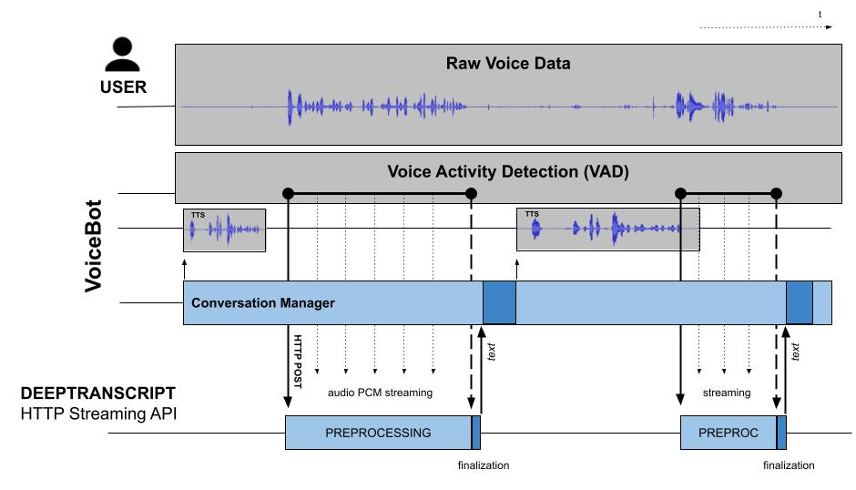

[DeepTranscript HTTP STREAMING API](https://app.deeptranscript.com/documentation#operation/transcriptions_http_stream) is especially useful for VoiceBot or CallBot-like applications where response time and high availability are critical.

With HTTP Streaming API, you can expect less than 150 ms response time on average for audio stream from 0 to 60 secs. 

To achieve such low latency, you have to detect and cut speeches from audio stream (using [Voice Activity Detection](https://en.wikipedia.org/wiki/Voice_activity_detection)) and pipe individual speeches in realtime through a basic HTTP request as described in [./pipe-microphone.js](./pipe-microphone.js) example

**Here is how it works:**



## Before you begin
 - Make sure you [signed up](https://app.deeptranscript.com/signup) and get your 20h evaluation welcome bonus
 - Retrieve your API Token from [members configuration](https://app.deeptranscript.com/account/members)


## Nodejs example

```shell script
$ cd ./path/to/deeptranscript-demo/
$ npm install
$ export API_TOKEN=<your-api-token-from-deeptranscript-console>  # see https://app.deeptranscript.com/account/members
$ LANGUAGE=en node ./examples/streaming/http/pipe-microphone.js
```

see [./pipe-microphone.js](./pipe-microphone.js) for more information
