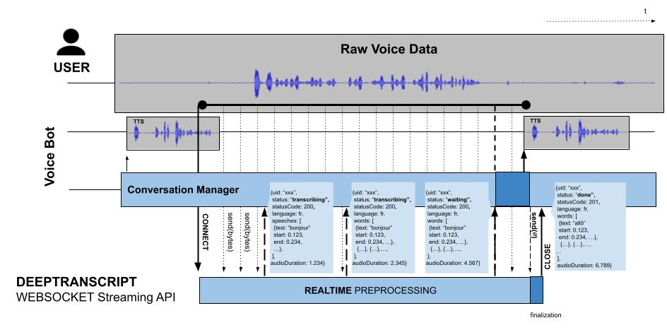

[DeepTranscript WEBSOCKET STREAMING API](https://app.deeptranscript.com/documentation#operation/transcriptions_ws_stream) is especially useful for VoiceBot or CallBot-like applications where accuracy, response time and high availability are critical.

With WEBSOCKET Streaming API, you can process input streams of any size and get intermediate results indicating if user is speaking and what is being said in almost realtime

**Here is how it works:**




See also the video below for a closer look on generated events:

[](https://www.youtube.com/watch?v=V1MKqoGvtkI)

## Before you begin
 - Make sure you [signed up](https://app.deeptranscript.com/signup) and get your 20h evaluation welcome bonus
 - Retrieve your API Token from [members configuration](https://app.deeptranscript.com/account/members)
 - Make sure all [dependencies are installed](/README.md#setup-debian-or-ubuntu)

## Nodejs examples

```shell script
$ cd ./path/to/deeptranscript-demo/
$ npm install
$ export API_TOKEN=<your-api-token-from-deeptranscript-console>  # see https://app.deeptranscript.com/account/members
$ LANGUAGE=<en|fr> node ./examples/streaming/websocket/pipe-<microphone|file>.js
```

NOTE: These examples also generate audacity files, displaying received events, words localizations and response times.

## Documentation
See [https://app.deeptranscript.com/documentation#operation/transcriptions_ws_stream](https://app.deeptranscript.com/documentation#operation/transcriptions_ws_stream) for more information
